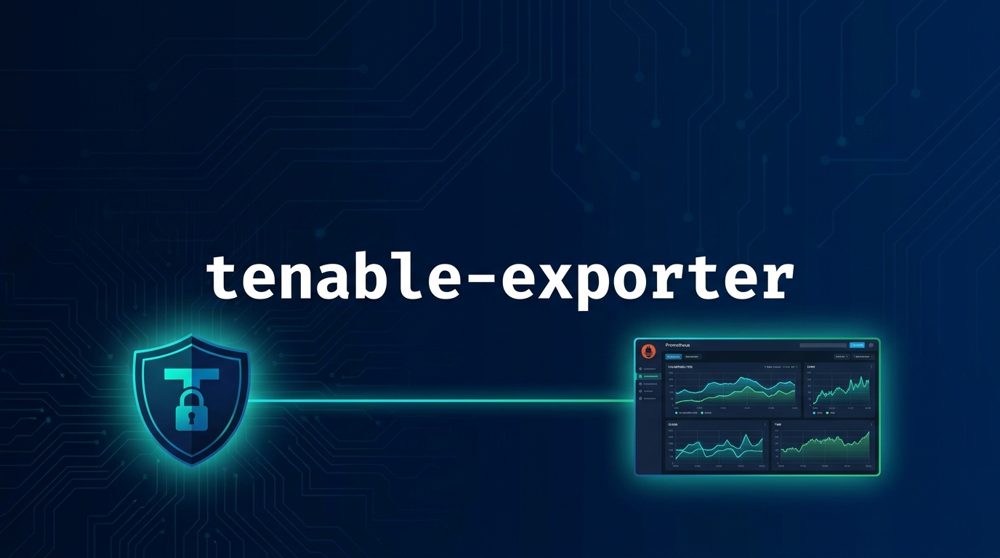

# tenable-exporter



[](https://github.com/polarpoint-io/tenable-exporter/actions/workflows/build.yml)
[](https://github.com/polarpoint-io/tenable-exporter/actions/workflows/codeql-analysis.yml)
[](LICENSE)

[](https://ghcr.io/polarpoint-io/tenable-exporter)

A Prometheus exporter for [Tenable.io](https://www.tenable.com/) built with [pyTenable](https://github.com/tenable/pyTenable).

Exports vulnerability, asset, and scan metrics so you can alert on them in Grafana or any Prometheus-compatible stack.

## Metrics

| Metric | Labels | Description |
|---|---|---|
| `tenable_vulnerabilities_total` | `severity` | Total vulnerabilities by severity (critical/high/medium/low/info) |
| `tenable_vulnerabilities_by_plugin_total` | `plugin_family` | Vulnerabilities grouped by plugin family |
| `tenable_assets_total` | — | Total number of assets |
| `tenable_assets_by_source_total` | `source` | Assets grouped by discovery source |
| `tenable_scans_total` | — | Total number of scans |
| `tenable_scans_by_status_total` | `status` | Scans grouped by status |
| `tenable_plugin_set_updated_timestamp` | — | Unix timestamp of the last plugin set update |

## Quick start

```bash
export TENABLE_ACCESS_KEY=your_access_key
export TENABLE_SECRET_KEY=your_secret_key

docker run -p 9190:9190 \
  -e TENABLE_ACCESS_KEY \
  -e TENABLE_SECRET_KEY \
  ghcr.io/polarpoint-io/tenable-exporter:main
```

Metrics will be available at `http://localhost:9190/metrics`.

## Docker Compose

```bash
cp .env.example .env
# Fill in your Tenable credentials in .env
docker compose up -d
```

## Configuration

| Environment variable | Default | Description |
|---|---|---|
| `TENABLE_ACCESS_KEY` | **required** | Tenable.io API access key |
| `TENABLE_SECRET_KEY` | **required** | Tenable.io API secret key |
| `EXPORTER_PORT` | `9190` | Port to expose metrics on |
| `SCRAPE_INTERVAL` | `300` | Seconds between Tenable API scrapes |

## Development

```bash
pip install -e ".[dev]"
python exporter.py
```

## License

MIT
